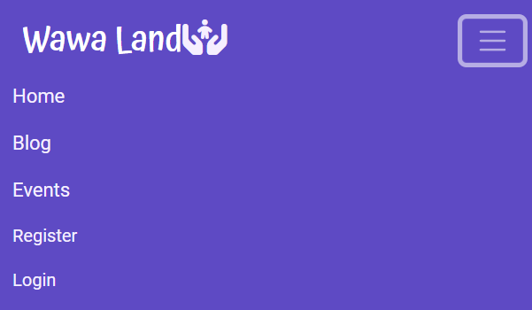
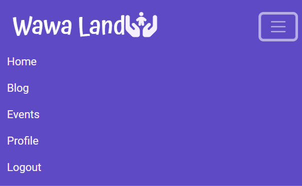
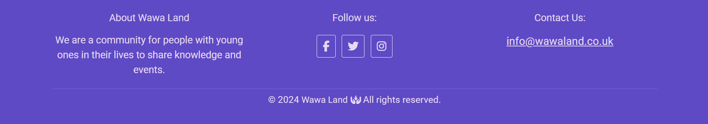

# WawaLand

WawaLand is a community blog and events page for families with babies and children. Users can review events and leave comments on blog posts. Not only that, but users can also add their own blog posts to the site and are visible once they have been approved by the WawaLand administration.

The inspiration of the name 'WawaLand' is from the Quechua language word for 'child', 'baby', or 'infant'.

Welcome to <a href="https://wawa-land-04eebd0de719.herokuapp.com/">WawaLand</a>

## Contents
* [**User Experience UX**](<#user-experience-ux>)
  * [Agile Methodology](<#agile-methodology>)
  * [User Stories](<#user-stories>)
  * [Site Structure](<#site-structure>)
  * [Design Choices](<#design-choices>)
    * [Typography](<#typography>)
    * [Colour Scheme](<#colour-scheme>)
    * [Wireframes](<#wireframes>)
* [**Features**](<#features>)
  * [Existing Features](<#existing-features>)
    * [Navigation Bar](<#navigation-bar>)
    * [Footer](<#footer>)
    * [Messages](<#messages>)
    * [Home Page](<#home-page>)
    * [Blog](<#blog>)
      * [Blog Post](<#blog-post>)
        * [Likes](<#likes>)
        * [Comments](<#comments>)
      * [Add New Blog Post](<#add-new-blog-post>)
    * [Events Page](<#add-new-expense>)
      * [Event Detail](<#event-detail>)
        * [Reviews](<#reviews>)
    * [Profile](<#profile>)
      * [Edit Blog Post](<#edit-blog-post>)
    * [Register](<#register>)
    * [Log In](<#log-in>)
    * [Sign Out](<#sign-out>)
    * [Error Pages](<#error-pages>)
    * [Admin Panel](<#admin-panel>)
  * [**Future Features**](<#future-features>)
* [**Technologies Used**](<#technologies-used>)
  * [Languages](<#languages>)
  * [Frameworks, Libraries and Packages](<#frameworks-libraries-and-packages>)
* [**Database**](<#database>)
* [**Testing**](<#testing>)
  * [Testing User Stories](<#testing-user-stories>)
    * [Site Owner](<#site-owner>) 
  * [Validation](<#validation>)
  * [Additional Testing](<#additional-testing>)
  * [Known Bugs](<#known-bugs>)
    * [Unresolved Bugs](<#unresolved-bugs>)
* [**Deployment**](<#deployment>)
  * [**To Deploy on Heroku**](<#to-deploy-on-heroku>)
  * [**To Deploy Locally on GitHub**](<#to-deploy-locally-on-github>)
  * [**To Fork the Project**](<#to-fork-the-project>)
  * [**To Clone the Project**](<#to-clone-the-project>)
  * [**Cloudinary**](<#cloudinary>)
  * [**PostgreSQL**](<#postgresql>)
* [**Credits**](<#credits>)
  * [**Content**](<#content>)
* [**Acknowledgements**](<#acknowledgements>)

# Features
  ## Existing Features

  - ### Navigation Bar
    Featured on all pages, the fully responsive navigation bar includes links to the Home page, Blog page, Events page, Log in and Register pages when the user is not logged in. Once the user logs in the Log in and Register links change to Sign Out and a user Profile page is made available. The nav bar allows the user to easily navigate to the main pages across the site.

    A decision was made to not put the Add Post page into the navigation bar as I wanted to make it clear that the Add Post function was only available for the blog.
  
    

Navigation Bar whilst user is logged out:

    
    
    
    
    

    

Navigation Bar whilst user is logged in:

    
    
    
    
    

    [Back To Top](<#contents>)

  - ### Footer
    The footer section has 4 sections which include 'About', which explains a bit about the site, 'Social Media', with links to the relevant social media sites for WawaLand, 'Contact Us', which includes a link to send us an email and the 'Copyright' section.

    

Footer

    
    
    
    
    

    
  [Back To Top](<#contents>)

  - ### Messages
    - #### Success Messages
    - #### Error Messages
  [Back To Top](<#contents>)

  - ### Home Page
  [Back To Top](<#contents>)

  - ### Blog
  [Back To Top](<#contents>)

  - ### Events Page 
  [Back To Top](<#contents>)

  - ### Profile
  [Back To Top](<#contents>)

  - ### Register
  [Back To Top](<#contents>)

  - ### Log In
  [Back To Top](<#contents>)

  - ### Sign Out
  [Back To Top](<#contents>)

  - ### Error Pages
  [Back To Top](<#contents>)

  - ### Admin Panel
  [Back To Top](<#contents>)