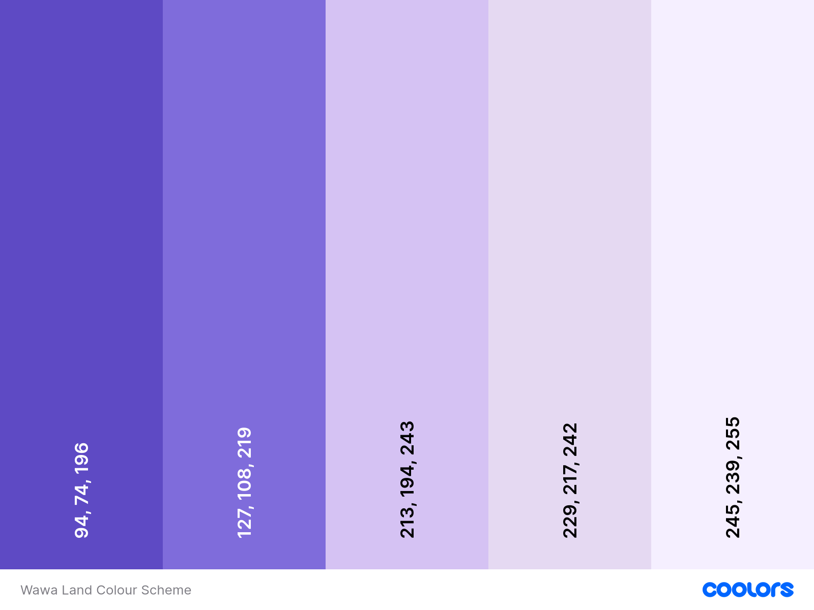
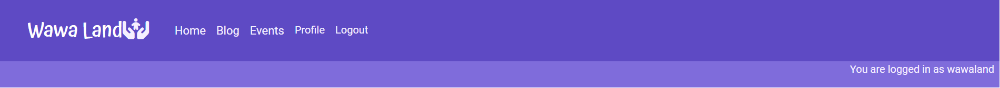

# Wawa Land

Wawa Land is a community blog and events page for families with babies and children. Users can review events and leave comments on blog posts. Not only that, but users can also add their own blog posts to the site and are visible once they have been approved by the Wawa Land administration.

The inspiration of the name 'Wawa Land' is from the Quechua language word for 'child', 'baby', or 'infant'.

Welcome to <a href="https://wawa-land-04eebd0de719.herokuapp.com/">Wawa Land</a>

## Contents
* [**User Experience UX**](<#user-experience-ux>)
  * [Agile Methodology](<#agile-methodology>)
  * [User Stories](<#user-stories>)
  * [Design Choices](<#design-choices>)
    * [Typography](<#typography>)
    * [Colour Scheme](<#colour-scheme>)
    * [Wireframes](<#wireframes>)
* [**Features**](<#features>)
  * [Existing Features](<#existing-features>)
    * [Navigation Bar](<#navigation-bar>)
    * [Logged In Banner](<#logged-in-banner>)
    * [Footer](<#footer>)
    * [Messages](<#messages>)
    * [Home Page](<#home-page>)
    * [Blog](<#blog>)
      * [Add New Blog Post](<#add-new-blog-post>)
      * [Blog Post](<#blog-post>)
        * [Likes](<#likes>)
        * [Comments](<#comments>)
    * [Events Page](<#add-new-expense>)
      * [Event Detail](<#event-detail>)
        * [Reviews](<#reviews>)
    * [Profile](<#profile>)
      * [Edit Blog Post](<#edit-blog-post>)
    * [Register](<#register>)
    * [Log In](<#log-in>)
    * [Sign Out](<#sign-out>)
    * [Error Pages](<#error-pages>)
    * [Admin Panel](<#admin-panel>)
  * [**Future Features**](<#future-features>)
* [**Technologies Used**](<#technologies-used>)
* [**Database**](<#database>)
  * [**PostgreSQL**](<#postgresql>)
* [**Testing**](<#testing>)
  * [Testing User Stories](<#testing-user-stories>)
    * [Site Owner](<#site-owner>) 
  * [Validation](<#validation>)
  * [Additional Testing](<#additional-testing>)
  * [Known Bugs](<#known-bugs>)
    * [Unresolved Bugs](<#unresolved-bugs>)
* [**Deployment**](<#deployment>)
  * [**Cloudinary**](<#cloudinary>)
  * [**To Deploy on Heroku**](<#to-deploy-on-heroku>)
  * [**To Deploy Locally on GitHub**](<#to-deploy-locally-on-github>)
  * [**To Fork the Project**](<#to-fork-the-project>)
  * [**To Clone the Project**](<#to-clone-the-project>)
* [**Credits**](<#credits>)
  * [**Content**](<#content>)
* [**Acknowledgements**](<#acknowledgements>)

# User Experience UX
  ## Agile Methodology
  Agile methodology is an approach to project management and software development that emphasizes flexibility, collaboration, and customer satisfaction. Agile prioritizes human interaction and collaboration over rigid processes, and emphasizes delivering functional software over comprehensive documentation.

  The kanban board for Wawa Land can be found [here](https://github.com/users/bpstephanie/projects/6/views/1).

  [Back To Top](<#contents>)

  ## User Stories
    1. As a **developer** I can **design wireframes** so that I can **see the project's layout and use it as a reference when designing pages.**

    Acceptance Criteria
    - Develop a wireframe that clearly shows the elements on the pages.
    - Ensure the wireframe creates an intuitive flow for navigation through the site.

    2. As a **user** I can **sign-up to the site** so that I can **view the content available to users.**

    Acceptance Criteria
    - I can use my email address to create an account.
    - I can create up a password.
    - When signed up, I can view the blog and events pages.

    3. As a **user** I can **login to my account** so that I can **view the content available to users.**

    Acceptance Criteria
    - I can use my email address and password i set when signing up.
    - When logged in, I can view the blog and events pages.

    4. As a **user** I can **click on blog** so that I can **see all the blog posts.**

    Acceptance Criteria
    - When blog is clicked on, a page is rendered with snippets of all blog posts.

    5. As a **user** I can **click on any blog post snippet** so that I can **read all the content.**

    Acceptance Criteria
    - When a blog post snippet is clicked, the user is taken to a new page with the full content.

    6. As a **site admin** I can **create, read, update and delete posts** so that I can **manage my blog content.**

    Acceptance Criteria
    - When a user is logged in, they can create a blog post.
    - When a user is logged in, they can read a blog post.
    - When a user is logged in, they can update a blog post.
    - When a user is logged in, they can delete a blog post.

    7. As a **site admin** I can **create, read, update and delete events** so that I can **manage my events content.**

    Acceptance Criteria
    - When a user is logged in, they can create an event.
    - When a user is logged in, they can read an event.
    - When a user is logged in, they can update an event.
    - When a user is logged in, they can delete an event.

    8. As a **developer** I can **deploy my project to Heroku** so that it **can be accessed by users on the internet.**

    Acceptance Criteria
    - Create a Django project and create the necessary directories and files.
    - Deploy the Django project to Heroku and make sure it runs successfully.

    9. As a **user** I can **click on events** so that I can **see all the events listed.**

    Acceptance Criteria
    - When events is clicked on, a page is rendered with a list of all events.

    10. As a **user** I can **click on any event listing** so that I can **read all the details.**

    Acceptance Criteria
    - When an event is clicked on the main events page, the user is taken to a new page with the full content.

    11. As a **user** I can **see what other users' opinions of events** so that I can **judge what type of events to go to.**

    Acceptance Criteria
    - On a specific event page, the user can see all approved reviews left by other users.

    12. As a **site user** I can **leave comments on a post** so that I can **be involved in the conversation.**

    Approval Criteria
    - A signed-in user can post a comment on a post.
    - When a user comment is approved, all users can see the comment.

    13. As a **site user** I can **leave comments on a post** so that I can **be involved in the conversation.**

    Approval Criteria
    - A signed-in user can leave a review on an event.
    - When a user review is approved, all users can see the review.

    14. As a **user** I can **add my own blog post** so that I can **share my knowledge with the community.**

    Acceptance Criteria
    - Signed in user can add a post to the database.
    - When the administrators of the site publish the post, all users can view the post.

    15. As a **user** I can **delete my draft blog post** so that I can **remove it so it is not shared with the community.**

    Acceptance Criteria
    - Given a logged in user, they can delete their unpublished post

    16. As a **user** I can **see all the posts I have written, published and unpublished, all my comments, reviews and likes** so that I can **keep track of all my interactions with the site.**

    Acceptance Criteria
    - A logged in user can view their profile page.

  [Back To Top](<#contents>)

  - ## Design Choices

    - ### Typography
      - Google fonts were used for Wawa Land.
      - For the site logo, Atma was used. This font was chosen for it's fun nature which conveys a friendly and aproachable feel.
      

      - Playfair was chosen for it's contrast between thick and thin strokes which enhances readability. Therfore, it is used for the blog post titles, event names and general titles  was chosen.

      

      - Roboto was chosen for larger bodies of text.
      

    - ### Colour Schemes
      The colours for Wawa Land were all tones of purple. Purple is a versatile, historically significant colour that appeals to a broad audience due to its lack of strong gender-specific connotations. Modern trends also favour purple for its cultural neutrality and wide range of shades, ensuring it resonates with diverse groups. I believe this is important for a site that targets children of all genders and promotes inclusivity.

      - Iris: rgb(94, 74, 196)
      - Medium Slate Blue: rgb(127, 108, 219)
      - Periwinke: rgb(213, 194, 243)
      - Pale Purple: rgb(229, 217, 242)
      - Magnolia: rgb(245, 239, 255)

      

      [Back To Top](<#contents>)

    - ### Wireframes
      I used Balsamiq to create the wireframes for this project.

      

Wireframe - Home Page

      

      

      

Wireframe - Blog

      

      

      

Wireframe - Blog Post

      

      

      

Wireframe - Events List

      

      

      

Wireframe - Event Listing

      

      

      [Back To Top](<#contents>)

# Features
  ## Existing Features

  - ## Site Wide Features

    - ### Navigation Bar
      Featured on all pages, the fully responsive navigation bar includes links to the Home page, Blog page, Events page, Log in and Register pages when the user is not logged in. Once the user logs in the Log in and Register links change to Sign Out and a user Profile page is made available. The nav bar allows the user to easily navigate to the main pages across the site.

      A decision was made to not put the Add Post page into the navigation bar as I wanted to make it clear that the Add Post function was only available for the blog.
    
      

Navigation Bar whilst user is logged out - Desktop View

      

      

      

Navigation Bar whilst user is logged out - Mobile View

      

      

      

Navigation Bar whilst user is logged in - Desktop View

      

      

      

Navigation Bar whilst user is logged in - Mobile View

      

      

      [Back To Top](<#contents>)
    
    - ### Logged In Banner
      Once a user has logged in, there is visual feedback in the form of a message stating their logged in status in a banner that is a slightly light shade than the navbar.

      

Logged In Banner - Desktop View

      

      

      

Logged In Banner - Mobile View

      

      

      [Back To Top](<#contents>)

    - ### Footer
      The footer section has 4 sections which include 'About', which explains a bit about the site, 'Social Media', with links to the relevant social media sites for Wawa Land, 'Contact Us', which includes a link to send us an email and the 'Copyright' section. The footer can be seen across all pages and is fully responsive.

      

Footer - Desktop View

      

      

      

Footer - Mobile View

      

      

      [Back To Top](<#contents>)

    - ### Messages
      Messages have been utilized to give users instant feedback for action they take. Success messages and error messages are distinguishable by their colour; green has been used for success and red for error messages.

      

Success Messages - Desktop View

      

      

      

Success Messages - Mobile View

      

      

      

Error Messages - Desktop View

      

      

      

Error Messages - Mobile View

      

      

      [Back To Top](<#contents>)

  - ## Pages

    - ### Home Page
      The homepage is the first page a user sees when coming to Wawa Land. The hero section includes a welcome message and a call to action to sign up. Below the hero section, the user can find out what to use Wawa Land for with navigable links to the Blog and the Event page. The cursor style changes when a user hovers over the respective sections, letting them know they are both links.

      

Home Page - Desktop View

      
      

      

      

Home Page - Mobile View

      
      

      

      [Back To Top](<#contents>)

    - ### Blog
      When a user clicks the 'Blog' in the navbar they are taken to the blog list page. At the top of the page there is a prompt for the user to add their own post. The button to take them to write their own post only appears to users who are logged in, if they are not they will be prompted to log in.
      
      Below, the user can see all the posts that are available to read on the site. The blog posts can be from any user and are displayed here once they have been approved by the Wawa Land administration. They are ordered with the newest appearing first. Users of the site (logged in or not) can click on a blog post title to be taken to read the full article. Only 6 posts will appear per page, users will be able to navigate through the pages of the blog to see all the content available.

      

Add Post Prompt

      
      

      

      

Blog Article List

      

      

      [Back To Top](<#contents>)

      - #### Add New Blog Post
        To reach this page, a user needs to have clicked on 'Add Post' on the blog page. The user is prompted to add their own blog post by a form. They must give their post a title and a body. If a user attempts to submit a post without a title or a body an error message appears at the top as well as visual feedback that the fields are required.

        

Add New Post Form

        
        

        

        

Visual Feedback for Invalid Form

        
        
        

        

        
        [Back To Top](<#contents>)

      - #### Blog Post
        Each blog post is rendered on it's own page. All posts have the same format of an image, placeholder or user uploaded, the title, the author and date and time the post was written or updated. Underneath the blog post the user can 'like' or 'unlike' the post. Below the likes section and comment counter, the user can leave their own comment.

        

Individual Blog Post

        

        

        
        [Back To Top](<#contents>)

        - ##### Likes
          Only logged-in users can 'like' or 'unlike' posts. For a successful 'like' a green success error message is shown at the top of the page. If a user 'unlikes' a post a red error message is shown. A red error message for 'unliking' was chosen as it may have been a mistake that the user clicked on the heart again, therefore I wanted to make the user aware the action they have taken. The likes show without the need for the page to be refreshed.

          Within the likes section, there is also a comment counter. The number of approved comments is shown.

          

Likes and Comment Counter Section

          

          

          
          [Back To Top](<#contents>)

        - ##### Comments
          Only logged-in users can comment on a post. If the user is not logged-in, they are prompted to log in to leave a comment. The 'log in' is a link to take the user to the log in page.

          Once a user is logged in, they can view all users comments as well as their own unapproved comments. There are 'Edit' and 'Delete' buttons under the user's own comments. If they choose to edit their comment, the 'Leave Comment' section is populated with the user's comment they wish to change. Once the user clicks update, the comment is shown on the left side. If the user chooses to update a comment that was already approved, it will need to be approved again by the Wawa Land admin. The 'Delete' button will bring up a modal message confirming if the user would like to delete it. This is a precaution as the user may have accidentally clicked the delete button. If this is the case the user can close the delete confirmation message and nothing will happen. If the user chooses to delete the comment, it will be deleted from the database. This action cannot be undone.

          

Comments Section

          

          

          

Edit Comment

          

          

          

Delete Comment Modal

          

          

          [Back To Top](<#contents>)

    - ### Events Page
      The events page show all events endorsed by Wawa Land. From the event list page users can see the name of the event, the age range it is suitable for and the date of the event. The events are in descending order where upcoming events are listed first. Users can click on the name of an event to be taken to the event detail page to read more about it.

      

Events List

      

      

      [Back To Top](<#contents>)

      - #### Event Detail Page
        Each event listing is rendered on it's own page. All events have the same format of an image, the name, more information about the event, the price, the time and the date of the event. Currently all events can only be added by the Wawa Land administration. This is due to security, as events are for babies and children, it waws decided that user-added events could pose a risk. Underneath the event listing the user can leave a review for the event.

        

Events Listing

        

        

        [Back To Top](<#contents>)

        - ##### Reviews
          Only logged-in users can review an event. If the user is not logged-in, they are prompted to log in to leave a review. The 'log in' is a link to take the user to the log in page.

          Once a user is logged in, they can view all users reviews as well as their own unapproved reviews. There are 'Edit' and 'Delete' buttons under the user's own reviews. If they choose to edit their review, the 'Leave a Review' section is populated with the user's review they wish to change. Once the user clicks update, the review is shown on the left side. If the user chooses to update a review that was already approved, it will need to be approved again by the Wawa Land admin. The 'Delete' button will bring up a modal message confirming if the user would like to delete it. This is a precaution as the user may have accidentally clicked the delete button. If this is the case the user can close the delete confirmation message and nothing will happen. If the user chooses to delete the review, it will be deleted from the database. This action cannot be undone.

          

Review Section

          

          

          

Edit Review

          

          

          

Delete Review Modal

          

          

    - ### Profile
      The profile page is where the user can see all the posts they have written, published or unpublished, all their comments on posts, approved or awating approval and all their likes. It is from the profile page that a user can edit a post, update a comment or delete either.

      

Profile Page - Posts Section

      

      

      

Profile Page - Comments Section

      

      

      

Profile Page - Likes Section

      

      

      [Back To Top](<#contents>)

        - #### Edit Blog Post
          The user is taken to this edit blog post page from the profile page. The title and body sections are pre-populated with the content of the post they want to edit. The user can use summernote features such as using 'bold' or 'italics' to name but a few. Once they have updated the post the user is redirected to the profile page.

          

Edit Blog Post

          

          

          [Back To Top](<#contents>)

    - ### Register
      On the Register page the user can create an account, optionally inputting their email address. If the user already has an account and visits this page they can navigate to the login page via a link.

      

Register Page

      

      

      [Back To Top](<#contents>)

    - ### Log In
      On this page, users who have already created an account can log in. They can toggle to have their details remembered to avoid having to enter the information again.

      

Login Page

      

      

      [Back To Top](<#contents>)

    - ### Sign Out
      When a user clicks the log out in the navigation bar , the user is taken to this page where they can confirm they want to log out.

      

Logout Page

      

      

      [Back To Top](<#contents>)

    - ### Error Pages
      If a page is not found, the user will be shown this page.

      

404 Error Page

      

      

      [Back To Top](<#contents>)

    - ### Admin Panel
      The admin panel can be accessed by the superuser. Here in the admin panel, the superuser can view all users, blog posts, comments, events and reviews. It is via the admin panel that the Wawa Land team can approve comments and reviews and publish blog posts.

      The posts can be ordered by title, slug, status or created on date. The events can be ordered by title, slug or age-range.

      

Admin Page

      

      

      

Admin - Posts Page

      

      

      

Admin - Events Page

      

      

      [Back To Top](<#contents>)

  ## Future Features
  There are many more feature that I wanted to include in this project for ease of users.
  - Social Login
    Enhance the user sign-up experience by integrating social login options for example; Google and Facebook. This not only would decrease the sign up time but also boosts the chances of users completing their registration.

  - Search Bar
    This would most likely be the next functionality to add. Currently users have to click through the pages to asee all posts and events, however adding a search field would allow users to look for specific posts and/or events.

  - Tags 
    Adding category tags to events and posts would allow users to search for a category and see everything relating to that category.

  - Calendar View
    The events page would benefit fom having a calendar, whereby users would be able to select a date and be shown all the events happening on that day.
  
  - Saved Events / Saved Posts
    It would be benefical for users to be able to save posts they are interested in or want to read at a later date in their profile. It would also be beneficial for users to be able to save events to their profile. If these capabilities were added to Wawa Land, other users would also be able to see how many saves each post or event had which would indicate popularity.

  - Thumbs Up / Thumbs Down
    Similar to the like functionality on the blog posts, Wawa Land could have a 'thumbs up', 'thumbs down' rating system where users can let Wawa Land know what sorts of events they like more than others. This will help Wawa Land in the future to list more events the users of the site are interested in.

  - Tickets
    On each event, users would be able to click a link to buy a ticket on their respective site. The events that are listed by Wawa Land are a mixture of their own events and events in the local area they trust, therefore tickets to certain events need to be purchased elsewhere but by having a link on the event detail page, users would easily be able to purchase tickets.

  - Email Notifications
    Whenever a user saves an event they would recieve an email letting them know the event is coming up.

    [Back To Top](<#contents>)

# Technologies Used

* [Python3 + Django](https://www.python.org/)
* [HTML5](https://html.spec.whatwg.org/)
* [CSS](https://www.w3.org/Style/CSS/specs.en.html)
* [JavaScript](https://developer.mozilla.org/en-US/docs/Learn/JavaScript/First_steps/What_is_JavaScript)
* [PostgreSQL](https://www.postgresql.org/)
* [Cloudinary](https://cloudinary.com/) - used for online storage of static files.
* [Gitpod](https://www.gitpod.io/#get-started) - used for writing code, committing and pushing to [Github](https://github.com/).
* [Github](https://github.com/) - used for storing the repository and for version control.
* [Heroku](https://dashboard.heroku.com/) - used to deploy and host the project.
* [Lucid](https://dashboard.heroku.com/) - used to create the ERD model for Wawa Land.
* [CloudConvert](https://cloudconvert.com/png-to-webp) - used to convert images to  webp.
* [TinyPNG](https://tinypng.com/) - used to optimize images.
* [PEP8](https://peps.python.org/pep-0008/) - used to validate python code.

[Back To Top](<#contents>)

# Database
- I used Code Institute's PostgreSQL database for Wawa Land.
- I created an Entity Relationshop Diagram (ERD) using [Lucid](https://dashboard.heroku.com/) to plan my database.

  ## PostgreSQL

  1. Navigate to [PostgreSQL](https://www.postgresql.org/) from Code Institute.
  2. Enter your student email address in the input field provided.
  3. Click Submit.
  4. Wait while the database is created.
  5. Check your email.
  6. You now have a URL you can use to connect your app to your database.

  [Back To Top](<#contents>)
# Testing
  Please refer [**_here_**](TESTING.md) for more information about testing on Wawa Land.

# Deployment

  ## Cloudinary API
  Cloudinary is used to store media assets online. This is particularly beneficial because Heroku does not preserve this type of data.

  - ### Steps to Obtain Your Cloudinary API Key:
    1. Register and log in to Cloudinary.
    2. Indicate Programmable Media for image and video API as your Primary interest.
    3. Copy your API Environment Variable from the Cloudinary Dashboard.
    4. Remove CLOUDINARY_URL = from the API value; this acts as the key.

  [Back To Top](<#contents>)

  ## To Deploy on Heroku
  The site was developed using [Gitpod](https://www.gitpod.io/#get-started). All commit messages were pushed to [Github](https://github.com/) using the GitPod terminal. The finished project was deployed in [Heroku](https://dashboard.heroku.com/).

  Before starting the process on [Heroku](https://dashboard.heroku.com/), you first need to enter 'pip3 freeze > requirements.txt' in the terminal in your IDE. This adds a list of dependencies to your requirements.txt file needed for deployment. Commit these changes and push to GitHub before you deploy.

  -  You can also update your 'requirements.txt' file once you have already deployed to Heroku, by entering 'pip freeze > requirements.txt'. Don't forget to commit your changes and push to GitHub.

  The process of deploying to [Heroku](https://dashboard.heroku.com/) is as follows:

  1. Log into [Heroku](https://dashboard.heroku.com/) (or create an account).

    

Heroku Step 1

    
    

    

  2. In the top right hand corner there is a button 'New' that releases a dropdown menu, where you need to click 'Create a new app'.

    

Heroku Step 2

    
    

    

  3. On the next page, you will need to add a name for your app and input what region you are in. Bear in mind that each app name is unique therefore you may need to try some different options out. Once you have decided on an app name and selected which region you are in. Click 'Create app'

    

Heroku Step 3

    
    

    

  4. On the next page, click the 'Settings' tab. Once you have clicked on the settings tab, click 'Reveal Config Vars' in the 'Config Vars' section. Next you will need to add values. For Wawa Land, three key value pairs were added:
      - KEY = "DISABLE_COLLECTSTATIC", VALUE = "1" Once the key and value input fields have been filled you have to click 'Add'.
      - KEY = "DATABASE_URL", the value is the url that was emailed to you when creating the databse. Then click 'Add'
      - KEY = "SECRET_KEY", the value is any random secret key containing numbers, letters and characters. You can use [Random Keygen](https://randomkeygen.com/) or invent your own. Then click 'Add'.

    

Heroku Step 4 - Settings Tab

    
    

    

    

Heroku Step 4 - Config Vars Section

    
    

    

  5. In your IDE terminal, you need to type the following code to install the project requirements:
    - pip3 install gunicorn~=20.1
    - pip3 install -r requirements.txt
    - pip3 freeze --local > requirements.txt

  6. Next, create an env.py file at the root level directory, which must containe the following:

    - import os
    - 
    - os.environ.setdefault("DATABASE_URL", "CI database URL")
    - os.environ.setdefault("SECRET_KEY", " Your secret key")

  7. Next, create a file at the root level directory called Procfile. In this file enter:
    -  web: gunicorn my_project.wsgi

  8. Next, in your settings.py file, set DEBUG = FALSE

    **YOU SHOULD ALWAYS SET DEBUG TO FALSE BEFORE DEPLOYING FOR SECURITY**

  9. Add ",'.herokuapp.com' " (without the double quotes) to the ALLOWED_HOSTS list in settings.py

  10. Next, add commit and push your code to [Github](https://github.com/).

  11. Next, on [Heroku](https://dashboard.heroku.com/), you need to go to the 'Deploy' tab. For 'Deployment Method', click 'GitHub'. Search for the repository name you want to deploy and then click connect.

    

Heroku Step 11 - Deploy Tab

    
    

    

    

Heroku Step 11 - Deployment Method

    
    

    

    

Heroku Step 11 - Connect to GitHub

      Wawa Land has already been connected to Heroku so mine will look a little different from yours. However, where you can see 'App Connected to GitHub' on the image, you will see 'Connect to GitHub, next to that you'll be able to search for the repository you want to connect.

    
  
    

  12. Scroll down to the sections below, called 'Automatic Deploys' and 'Manual Deploy'. Here you need to choose which option best suits your project. Once selected, click 'Deploy Branch'.

    

Heroku Step 12 - Deploy

    
    

    

  13. If you are using [Cloudinary](https://cloudinary.com/), go back to the 'Settings' tab on heroku, reveal config vars and add a new KEY, VALUE pair:
    - KEY = "CLOUDINARY_URL", VALUE = "your cloudinary api"

  14. For final deployment, or once static files have been added to your project, you need to remove the following KEY, VALUE pair:
    - KEY = "DISABLE_COLLECTSTATIC", VALUE = "1"

    

Heroku Step 14 - Final Deployment

    
    

    

  The live link can be found here - <a href="https://wawa-land-04eebd0de719.herokuapp.com/">Wawa Land</a>

  [Back To Top](<#contents>)

  ## To Deploy Locally on GitHub
  ## To Fork the Project
  A copy of the GitHub Repository can be made by forking the GitHub account. This copy can be viewed and changes can be made to the copy without affecting the original repository. The steps to fork the repository are as follows:

  1. Log in to GitHub and locate the repository.

  2. On the right hand side of the page, in line with the repository name, is a button called 'Fork', click on the button to create a copy of the original repository in your GitHub Account.

    

How to Fork

    
    

    

  [Back To Top](<#contents>)

  ## To Clone the Project
  The steps to clone a project from GitHub are as follows:

  1. Under the repository’s name, click on the code tab.
  2. Copy the URL under the Clone with HTTPS section.
  3. In an IDE of your choice, open Git Bash.
  4. Change the current working directory to the location of where the cloned directory will be made.
  5. Type 'git clone' then paste the URL copied from GitHub.
  6. Upon pressing enter, the local clone will be created.

    

How to Clone

    

    

  After cloning or forking the project, follow these steps to run it locally:

  1. Run the Server by typing the following in the terminal: python3 manage.py runserver
  2. Stop the app once it is loaded by pressing CTRL+C (Windows/Linux) or ⌘+C (Mac).
  3. Make migrations by typing: python3 manage.py makemigrations
  4. Migrate the data by typing: python3 manage.py migrate
  5. Create a superuser by typing: python3 manage.py createsuperuser

  [Back To Top](<#contents>)

# Credits
- I used the "I Think Therefore I Blog" walkthrough from the course content as a foundation to understand Django. I customized the models, views, and templates to develop Wawa Land.

[Back To Top](<#contents>)

## Acknowledgements

Wawa Land has been completed as a Portfolio 4 Project, part of the Full Stack Software Developer Diploma at Code Institute. I would like to thank my Code Institute mentor,  Precious Ijege for his advice and support, the Slack community, and everyone at Code Institute for their feedback and guidance. I would also like to thank Emma Lamont, who I met at a hackathon, for her help and advice on this project.

Stephanie Bell 2024.

 [Back To Top](<#contents>)

  
    
