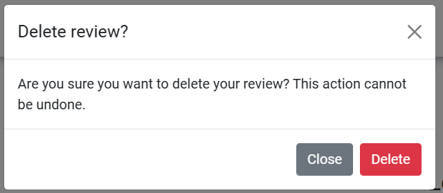

# Wawa Land

Wawa Land is a community blog and events page for families with babies and children. Users can review events and leave comments on blog posts. Not only that, but users can also add their own blog posts to the site and are visible once they have been approved by the Wawa Land administration.

The inspiration of the name 'Wawa Land' is from the Quechua language word for 'child', 'baby', or 'infant'.

Welcome to <a href="https://wawa-land-04eebd0de719.herokuapp.com/">Wawa Land</a>

## Contents
* [**User Experience UX**](<#user-experience-ux>)
  * [Agile Methodology](<#agile-methodology>)
  * [User Stories](<#user-stories>)
  * [Site Structure](<#site-structure>)
  * [Design Choices](<#design-choices>)
    * [Typography](<#typography>)
    * [Colour Scheme](<#colour-scheme>)
    * [Wireframes](<#wireframes>)
* [**Features**](<#features>)
  * [Existing Features](<#existing-features>)
    * [Navigation Bar](<#navigation-bar>)
    * [Logged In Banner](<#logged-in-banner>)
    * [Footer](<#footer>)
    * [Messages](<#messages>)
    * [Home Page](<#home-page>)
    * [Blog](<#blog>)
      * [Add New Blog Post](<#add-new-blog-post>)
      * [Blog Post](<#blog-post>)
        * [Likes](<#likes>)
        * [Comments](<#comments>)
    * [Events Page](<#add-new-expense>)
      * [Event Detail](<#event-detail>)
        * [Reviews](<#reviews>)
    * [Profile](<#profile>)
      * [Edit Blog Post](<#edit-blog-post>)
    * [Register](<#register>)
    * [Log In](<#log-in>)
    * [Sign Out](<#sign-out>)
    * [Error Pages](<#error-pages>)
    * [Admin Panel](<#admin-panel>)
  * [**Future Features**](<#future-features>)
* [**Technologies Used**](<#technologies-used>)
  * [Languages](<#languages>)
  * [Frameworks, Libraries and Packages](<#frameworks-libraries-and-packages>)
* [**Database**](<#database>)
* [**Testing**](<#testing>)
  * [Testing User Stories](<#testing-user-stories>)
    * [Site Owner](<#site-owner>) 
  * [Validation](<#validation>)
  * [Additional Testing](<#additional-testing>)
  * [Known Bugs](<#known-bugs>)
    * [Unresolved Bugs](<#unresolved-bugs>)
* [**Deployment**](<#deployment>)
  * [**To Deploy on Heroku**](<#to-deploy-on-heroku>)
  * [**To Deploy Locally on GitHub**](<#to-deploy-locally-on-github>)
  * [**To Fork the Project**](<#to-fork-the-project>)
  * [**To Clone the Project**](<#to-clone-the-project>)
  * [**Cloudinary**](<#cloudinary>)
  * [**PostgreSQL**](<#postgresql>)
* [**Credits**](<#credits>)
  * [**Content**](<#content>)
* [**Acknowledgements**](<#acknowledgements>)

# Features
  ## Existing Features

  - ## Site Wide Features

    - ### Navigation Bar
      Featured on all pages, the fully responsive navigation bar includes links to the Home page, Blog page, Events page, Log in and Register pages when the user is not logged in. Once the user logs in the Log in and Register links change to Sign Out and a user Profile page is made available. The nav bar allows the user to easily navigate to the main pages across the site.

      A decision was made to not put the Add Post page into the navigation bar as I wanted to make it clear that the Add Post function was only available for the blog.
    
      

Navigation Bar whilst user is logged out - Desktop View

      
      

      

Navigation Bar whilst user is logged out - Mobile View

      
      

      

Navigation Bar whilst user is logged in - Desktop View

      
      

      

Navigation Bar whilst user is logged in - Mobile View

      
      

      [Back To Top](<#contents>)
    
    - ### Logged In Banner
      Once a user has logged in, there is visual feedback in the form of a message stating their logged in status in a banner that is a slightly light shade than the navbar.

      

Logged In Banner - Desktop View

      
      

      

Logged In Banner - Mobile View

      
      

      [Back To Top](<#contents>)

    - ### Footer
      The footer section has 4 sections which include 'About', which explains a bit about the site, 'Social Media', with links to the relevant social media sites for Wawa Land, 'Contact Us', which includes a link to send us an email and the 'Copyright' section. The footer can be seen across all pages and is fully responsive.

      

Footer - Desktop View

      
      

      

Footer - Mobile View

      
      

      [Back To Top](<#contents>)

    - ### Messages
      Messages have been utilized to give users instant feedback for action they take. Success messages and error messages are distinguishable by their colour; green has been used for success and red for error messages.

      

Success Messages - Desktop View

      
      

      

Success Messages - Mobile View

      
      

      

Error Messages - Desktop View

      
      

      

Error Messages - Mobile View

      
      

      [Back To Top](<#contents>)

  - ## Pages

    - ### Home Page
      The homepage is the first page a user sees when coming to Wawa Land. The hero section includes a welcome message and a call to action to sign up. Below the hero section, the user can find out what to use Wawa Land for with navigable links to the Blog and the Event page. The cursor style changes when a user hovers over the respective sections, letting them know they are both links.

      

Home Page - Desktop View

      
      
      

      

Home Page - Mobile View

      
      
      

      [Back To Top](<#contents>)

    - ### Blog
      When a user clicks the 'Blog' in the navbar they are taken to the blog list page. At the top of the page there is a prompt for the user to add their own post. The button to take them to write their own post only appears to users who are logged in, if they are not they will be prompted to log in.
      
      Below, the user can see all the posts that are available to read on the site. The blog posts can be from any user and are displayed here once they have been approved by the Wawa Land administration. They are ordered with the newest appearing first. Users of the site (logged in or not) can click on a blog post title to be taken to read the full article. Only 6 posts will appear per page, users will be able to navigate through the pages of the blog to see all the content available.

      

Add Post Prompt

      
      
      

      

Blog Article List

      
      

      [Back To Top](<#contents>)

      - #### Add New Blog Post
        To reach this page, a user needs to have clicked on 'Add Post' on the blog page. The user is prompted to add their own blog post by a form. They must give their post a title and a body. If a user attempts to submit a post without a title or a body an error message appears at the top as well as visual feedback that the fields are required.

        

Add New Post Form

        
        
        

        

Visual Feedback for Invalid Form

        
        
        
        

        
        [Back To Top](<#contents>)

      - #### Blog Post
        Each blog post is rendered on it's own page. All posts have the same format of an image, placeholder or user uploaded, the title, the author and date and time the post was written or updated. Underneath the blog post the user can 'like' or 'unlike' the post. Below the likes section and comment counter, the user can leave their own comment.

        

Individual Blog Post

        
        

        
        [Back To Top](<#contents>)

        - ##### Likes
          Only logged-in users can 'like' or 'unlike' posts. For a successful 'like' a green success error message is shown at the top of the page. If a user 'unlikes' a post a red error message is shown. A red error message for 'unliking' was chosen as it may have been a mistake that the user clicked on the heart again, therefore I wanted to make the user aware the action they have taken. The likes show without the need for the page to be refreshed.

          Within the likes section, there is also a comment counter. The number of approved comments is shown.

          

Likes and Comment Counter Section

          
          

          
          [Back To Top](<#contents>)

        - ##### Comments
          Only logged-in users can comment on a post. If the user is not logged-in, they are prompted to log in to leave a comment. The 'log in' is a link to take the user to the log in page.

          Once a user is logged in, they can view all users comments as well as their own unapproved comments. There are 'Edit' and 'Delete' buttons under the user's own comments. If they choose to edit their comment, the 'Leave Comment' section is populated with the user's comment they wish to change. Once the user clicks update, the comment is shown on the left side. If the user chooses to update a comment that was already approved, it will need to be approved again by the Wawa Land admin. The 'Delete' button will bring up a modal message confirming if the user would like to delete it. This is a precaution as the user may have accidentally clicked the delete button. If this is the case the user can close the delete confirmation message and nothing will happen. If the user chooses to delete the comment, it will be deleted from the database. This action cannot be undone.

          

Comments Section

          
          

          

Edit Comment

          
          

          

Delete Comment Modal

          
          

          [Back To Top](<#contents>)

    - ### Events Page
      The events page show all events endorsed by Wawa Land. From the event list page users can see the name of the event, the age range it is suitable for and the date of the event. The events are in descending order where upcoming events are listed first. Users can click on the name of an event to be taken to the event detail page to read more about it.

      

Events List

      
      

      [Back To Top](<#contents>)

      - #### Event Detail Page
        Each event listing is rendered on it's own page. All events have the same format of an image, the name, more information about the event, the price, the time and the date of the event. Currently all events can only be added by the Wawa Land administration. This is due to security, as events are for babies and children, it waws decided that user-added events could pose a risk. Underneath the event listing the user can leave a review for the event.

        

Events Listing

        
        

        [Back To Top](<#contents>)

        - ##### Reviews
          Only logged-in users can review an event. If the user is not logged-in, they are prompted to log in to leave a review. The 'log in' is a link to take the user to the log in page.

          Once a user is logged in, they can view all users reviews as well as their own unapproved reviews. There are 'Edit' and 'Delete' buttons under the user's own reviews. If they choose to edit their review, the 'Leave a Review' section is populated with the user's review they wish to change. Once the user clicks update, the review is shown on the left side. If the user chooses to update a review that was already approved, it will need to be approved again by the Wawa Land admin. The 'Delete' button will bring up a modal message confirming if the user would like to delete it. This is a precaution as the user may have accidentally clicked the delete button. If this is the case the user can close the delete confirmation message and nothing will happen. If the user chooses to delete the review, it will be deleted from the database. This action cannot be undone.

          

Review Section

          
          

          

Edit Review

          
          

          

Delete Review Modal

          
          

    - ### Profile
      The profile page is where the user can see all the posts they have written, published or unpublished, all their comments on posts, approved or awating approval and all their likes. It is from the profile page that a user can edit a post, update a comment or delete either.

      

Profile Page - Posts Section

      
      

      

Profile Page - Comments Section

      
      

      

Profile Page - Likes Section

      
      

      [Back To Top](<#contents>)

        - #### Edit Blog Post
          The user is taken to this edit blog post page from the profile page. The title and body sections are pre-populated with the content of the post they want to edit. The user can use summernote features such as using 'bold' or 'italics' to name but a few. Once they have updated the post the user is redirected to the profile page.

          

Edit Blog Post

          
          

          [Back To Top](<#contents>)

    - ### Register
      On the Register page the user can create an account, optionally inputting their email address. If the user already has an account and visits this page they can navigate to the login page via a link.

      

Register Page

      
      

      [Back To Top](<#contents>)

    - ### Log In
      On this page, users who have already created an account can log in. They can toggle to have their details remembered to avoid having to enter the information again.

      

Login Page

      
      

      [Back To Top](<#contents>)

    - ### Sign Out
      When a user clicks the log out in the navigation bar , the user is taken to this page where they can confirm they want to log out.

      

Logout Page

      
      

      [Back To Top](<#contents>)

    - ### Error Pages
      If a page is not found, the user will be shown this page.

      

404 Error Page

      
      

      [Back To Top](<#contents>)

    - ### Admin Panel
      The admin panel can be accessed by the superuser. Here in the admin panel, the superuser can view all users, blog posts, comments, events and reviews. It is via the admin panel that the Wawa Land team can approve comments and reviews and publish blog posts.

      The posts can be ordered by title, slug, status or created on date. The events can be ordered by title, slug or age-range.

      

Admin Page

      
      

      

Admin - Posts Page

      
      

      

Admin - Events Page

      
      

      [Back To Top](<#contents>)

  ## Future Features
  There are many more feature that I wanted to include in this project for ease of users.
  - # Social Login
    Enhance the user sign-up experience by integrating social login options for example; Google and Facebook. This not only would decrease the sign up time but also boosts the chances of users completing their registration.

  - # Search Bar
    This would most likely be the next functionality to add. Currently users have to click through the pages to asee all posts and events, however adding a search field would allow users to look for specific posts and/or events.

  - # Tags 
    Adding category tags to events and posts would allow users to search for a category and see everything relating to that category.

  - # Calendar View
    The events page would benefit fom having a calendar, whereby users would be able to select a date and be shown all the events happening on that day.
  
  - # Saved Events / Saved Posts
    It would be benefical for users to be able to save posts they are interested in or want to read at a later date in their profile. It would also be beneficial for users to be able to save events to their profile. If these capabilities were added to Wawa Land, other users would also be able to see how many saves each post or event had which would indicate popularity.

  - # Thumbs Up / Thumbs Down
    Similar to the like functionality on the blog posts, Wawa Land could have a 'thumbs up', 'thumbs down' rating system where users can let Wawa Land know what sorts of events they like more than others. This will help Wawa Land in the future to list more events the users of the site are interested in.

  - # Tickets
    On each event, users would be able to click a link to buy a ticket on their respective site. The events that are listed by Wawa Land are a mixture of their own events and events in the local area they trust, therefore tickets to certain events need to be purchased elsewhere but by having a link on the event detail page, users would easily be able to purchase tickets.

  - # Email Notifications
    Whenever a user saves an event they would recieve an email letting them know the event is coming up.

    [Back To Top](<#contents>)

# Technologies Used

* [Python3 + Django](https://www.python.org/)
* [HTML5](https://html.spec.whatwg.org/)
* [CSS](https://www.w3.org/Style/CSS/specs.en.html)
* [JavaScript](https://developer.mozilla.org/en-US/docs/Learn/JavaScript/First_steps/What_is_JavaScript)
* [PostgreSQL](https://www.postgresql.org/)
* [Cloudinary](https://cloudinary.com/) - used for online storage of static files.
* [Gitpod](https://www.gitpod.io/#get-started) - used for writing code, committing and pushing to [Github](https://github.com/).
* [Github](https://github.com/) - used for storing the repository and for version control.
* [Heroku](https://dashboard.heroku.com/) - used to deploy and host the project.
* [Lucid](https://dashboard.heroku.com/) - used to create the ERD model for Wawa Land.
* [CloudConvert](https://cloudconvert.com/png-to-webp) - used to convert images to  webp.
* [TinyPNG](https://tinypng.com/) - used to optimize images.
* [PEP8](https://peps.python.org/pep-0008/) - used to validate python code.

[Back To Top](<#contents>)

    
