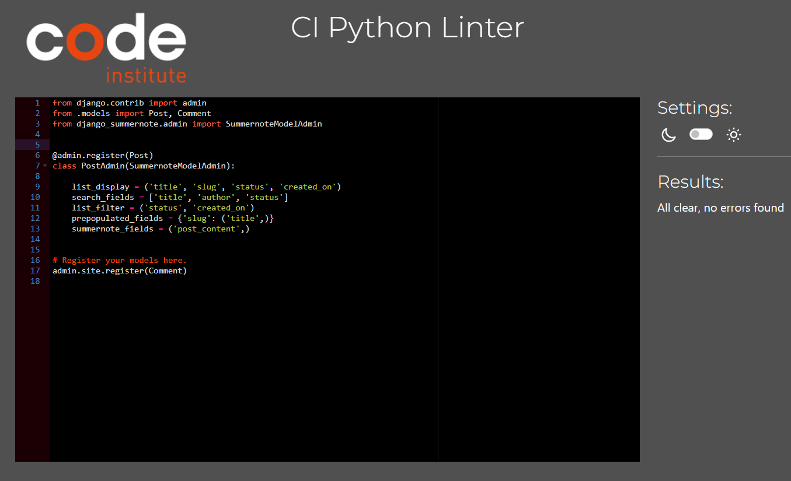

# Testing

## Validator Testing

Wawa Land has been thoroughly tested. All the code has been run through the [W3C HTML Validator](https://validator.w3.org/), the [W3C CSS Validator](https://jigsaw.w3.org/css-validator/) and the [JSHint JavaScript Validator](https://jshint.com/). 

- ### HTML

| Page                    | Screenshot                                                                             | Notes    |
|-------------------------|----------------------------------------------------------------------------------------|----------|
| Home                    |                                  | PASS     |
| Blog - Logged out       |                 | PASS     |
| Blog - Logged in        |                 | PASS     |
| Blog Post - Logged out  |          | The code the validator is referring to is code which has been integrated by Django for the comment functionality and not written by me. The '
' tag cannot be deleted by me.     |
| Blog Post - Logged in   |                 | The code the validator is referring to is code which has been integrated by Django for the comment functionality and not written by me. The id is specific to each review and the '
' tag cannot be deleted by me.     |
| Event List             |                 | PASS     |
| Event Listing - Logged out          |                 | The code the validator is referring to is code which has been integrated by Django for the review functionality and not written by me. The id is specific to each review and the '
' tag cannot be deleted by me.   |
| Event Listing - Logged in          |                 | The code the validator is referring to is code which has been integrated by Django for the review functionality and not written by me. The '
' tag cannot be deleted by me.   |
| Add Post      |                 | The code validator is referring to errors in code that have been integrated by Django that add Summernote to the body field. I cannot amend this code.      |
| Profile       |                 | The code the validator is referring to is code which has been integrated by Django for the posts and comments functionality and not written by me. The '
' tag cannot be deleted by me.     |
| Edit Post       |                | The code validator is referring to errors in code that have been integrated by Django that add Summernote to the body field. I cannot amend this code.     |
| Login          |                                  | PASS     |
| Register        |                                  | The code the validator is referring to is integrated by Django and not written by me.     |
| Sign Out        |                                  | PASS     |

- ### CSS
The CSS Validator Results:

- ### Python and Django
The CI Python Linter Validator
| File                    | Screenshot                                                                             | Notes    |
|-------------------------|----------------------------------------------------------------------------------------|----------|
| Blog - Admin            |                                 | PASS     |
| Blog - Apps             |                                   | PASS     |
| Blog - Forms            |                                 | PASS     |
| Blog - Models           |                               | PASS     |
| Blog - Urls             |                                   | PASS     |
| Blog - Views            |                                 | PASS     |
| Event - Admin           |                                | PASS     |
| Event - Apps            |                                 | PASS     |
| Event - Forms           |                               | PASS     |
| Event - Models          |                             | PASS     |
| Event - Urls            |                                 | PASS     |
| Event - Views           |                               | PASS     |
| Wawaland - Settings     |                 | PASS     |
| Wawaland - Urls         |                         | PASS     |
| Wawaland - Wsgi         |                         | PASS     |

- ### JavaScript
The JSHINT Validator
| File                    | Screenshot                                                                             | Notes    |
|-------------------------|----------------------------------------------------------------------------------------|----------|
| comments.js             |                           | PASS     |
| posts.js                |                                | PASS     |
| profile.js              |                             | PASS     |
| reviews.js              |                             | PASS     |

- ### Lighthouse
| Page                      | Device     | Screenshot                                                                       |
|---------------------------|------------|----------------------------------------------------------------------------------|
| Home                      | Desktop    |                       |
| Home                      | Mobile     |                         |
| Blog - Logged In          | Desktop    |                    |
| Blog - Logged In          | Mobile     |                      |
| Blog - Logged Out         | Desktop    |                |
| Blog - Logged Out         | Mobile     |                  |
| Blog Post - Logged In     | Desktop    |          |
| Blog Post - Logged In     | Mobile     |            |
| Blog Post - Logged Out    | Desktop    |      |
| Blog Post - Logged Out    | Mobile     |            |
| Event Page                | Desktop    |                     |
| Event Page                | Mobile     |                       |
| Event Listing - Logged In | Desktop    |  |
| Event Listing - Logged In | Mobile     |    |
| Event Listing - Logged Out| Desktop    |  |
| Event Listing - Logged Out| Mobile     |    |
| Add New Post              | Desktop    |               |
| Add New Post              | Mobile     |                 |
| Edit Post                 | Desktop    |             |
| Edit Post                 | Mobile     |               |
| Profile                   | Desktop    |                 |
| Profile                   | Mobile     |                   |
| Register                  | Desktop    |               |
| Register                  | Mobile     |                 |
| Login                    | Desktop    |                     |
| Login                    | Mobile     |                       |
| Logout                   | Desktop    |                  |
| Logout                   | Mobile     |                    |

#### Future Improvements for Lighthouse Testing

## Manual Testing
- Manual testing was carried out on local and deployed sites.

| Location     | Feature                              | Expected Outcome                                 | Pass/Fail|
|--------------|--------------------------------------|--------------------------------------------------|----------|
| Header       | Home button                          | Takes user to home                               |  PASS    |
| Header       | Blog button                          | Takes user to blog                               |  PASS    |
| Header       | Events button                        | Takes user to events page                        |  PASS    |
| Header       | Register button                      | Takes user to sign up page                       |  PASS    |
| Header       | Login button                         | Takes user to login page                        |  PASS    |
| Header       | Logout button (for logged in users) | Takes user to logout page                       |  PASS    |
| Header       | Profile button (for logged in users) | Takes user to profile page                       |  PASS    |
| Home page    | Hero section - sign up link (for logged out users)         | Takes user to sign up page                       |  PASS    |
| Home page    | Read our blogs (link)..              | Takes user to blog page                          |  PASS    |
| Home page    | Attend our events (link)..           | Takes user to events page                        |  PASS    |
| Blog page    | Log in to write a post (for logged out users)          | Takes user to login page                        |  PASS    |
| Blog page    | Add post button                      | Takes user to add post page                      |  PASS    |
| Blog page    | Post listings                        | When a post title is clicked it takes user to individual blog post page                        |  PASS    |
| Blog page    | Next button                        | If there are more than 6 posts then a 'next' button will appear for users to click through different post pages                        |  PASS    |
| Blog page    | Prev button                        | If there are more than 6 posts, on page 2 and onwards a 'prev' button will appear for users to click through different post pages                        |  PASS    |
| Blog Detail page    | Like button                      | When clicked, a like is registered and success message is shown to user                      |  PASS    |
| Blog Detail page    | Like button                      | If the user has previously liked, When clicked again, a like removal is registered and error message is shown to the user                      |  PASS    |
| Blog Detail page    | Comment counter                      | When any user's comment has been approved, the comment counter increases by one                      |  PASS    |
| Blog Detail page    | Leave comment field empty                    | If the user leaves an empty comment but clicks the submit button, the user is prompted to fill in the comment                      |  PASS    |
| Blog Detail page    | Leave comment                      | When the user leaves a comment, the comment can be seen in the comments section on the left                      |  PASS    |
| Blog Detail page    | Unapproved comments                      | The user can see their unapproved comments faded out                      |  PASS    |
| Blog Detail page    | Approved comments                      | All users can see their approved comments from all users                      |  PASS    |
| Blog Detail page    | Edit button on comments                      | When clicked, the user can update their own comments and see the reflected change instantly                      |  PASS    |
| Blog Detail page    | Delete button modal on comments                      | When clicked, a delete confirmation modal is shown to the user confirming whether or not they would like to delete their comment                      |  PASS    |
| Blog Detail page    | Delete button in modal                     | When clicked, the users' comment is permanently deleted from the database                      |  PASS    |
| Add Post page    | Leave title field empty                     | If the user leaves an empty title but clicks the submit button, the user is prompted to fill in the title                     |  PASS    |
| Add Post page    | Leave body field empty                     | If the user fills in the title field but leaves an empty body and clicks the submit button, the user is shown an error message at the top and 'This field is required' appears on the form                     |  PASS    |
| Add Post page    | Add image                     | If the user adds their own image to the post, it is shown on the blog post when the post has been approved by the administration                     |  PASS    |
| Events page      | Event listings                    | When an event name is clicked it takes user to individual event listing page                     |  PASS    |
| Events page    | Next button                        | If there are more than 9 event listings then a 'next' button will appear for users to click through different event pages                        |  PASS    |
| Events page    | Prev button                        | If there are more than 9 event listings, on page 2 and onwards a 'prev' button will appear for users to click through different event pages                        |  PASS    |
| Event Detail page    | Review counter                      | When any user's review has been approved, the review counter increases by one                      |  PASS    |
| Event Detail page    | Leave review                      | When the user leaves a review, the review can be seen in the reviews section on the left                      |  PASS    |
| Event Detail page    | Unapproved reviews                      | The user can see their unapproved reviews faded out                      |  PASS    |
| Event Detail page    | Approved reviews                      | All users can see their approved reviews from all users                      |  PASS    |
| Event Detail page    | Edit button on reviews                      | When clicked, the user can update their own reviews and see the reflected change instantly                      |  PASS    |
| Event Detail page    | Delete button Modal on reviews                      | When clicked, a delete confirmation modal is shown to the user confirming whether or not they would like to delete their review                      |  PASS    |
| Event Detail page    | Delete button in modal                     | When clicked, the users' review is permanently deleted from the database                      |  PASS    |
| Profile page    | Published posts section                     | All the users' published posts are listed in this section                      |  PASS    |
| Profile page    | Unpublished posts section                     | All the users' unpublished posts are listed in this section                      |  PASS    |
| Profile page    | Approved comments section                     | All the users' approved comments are listed in this section                      |  PASS    |
| Profile page    | Comments awaiting approval section                   | All the users' comments awaiting approval are listed in this section                      |  PASS    |
| Profile page    | Likes section                 | All the users' likes on posts are listed in this section                      |  PASS    |
| Profile page    | Post edit button                 | When clicked, the user is taken to the edit post page                      |  PASS    |
| Profile page    | Post delete button                 | When clicked, the delete confirmation modal is opened and the user can confirm permanent deletion of the post                      |  PASS    |
| Profile page    | Comment edit button                 | When clicked, the edit comment modal is opened and the user can update their comment                      |  PASS    |
| Profile page    | Edit comment modal save changes button                 | When clicked, the user is taken to the post the comment was made on                      |  PASS    |
| Profile page    | Comment delete button                 | When clicked, the delete confirmation modal is opened and the user can confirm permanent deletion of the comment and is then taken to the post the comment was made on                     |  PASS    |
| Edit Post page    | Empty title field                     | If the user leaves an empty title but clicks the submit button, the user is prompted to fill in the title                     |  PASS    |
| Edit Post page    | Empty body field                     | If the user fills in the title field but leaves an empty body and clicks the submit button, the user is shown an error message at the top and 'This field is required' appears on the form                     |  PASS    |
| Edit Post page    | Add image                     | If the user adds their own image to the post, it is shown on the blog post when the post has been approved by the administration                     |  PASS    |
| Login page    | Sign in button                    | If the user clicks the sign in button with an unknown/wrong username or password, the user will be prompted to enter a correct username/password combination                     |  PASS    |
| Login page    | Sign in button                    | If the user clicks the sign in button with an known username and password, the user will be signed in                    |  PASS    |
| Register page    | Sign up button                    | If the user clicks the sign up button with an unknown/wrong username or password, the user will be prompted to enter a correct username/password combination                     |  PASS    |
| Register page    | Sign up button                    | If the user enters a username which doesn't comply with the criteria they will not be registered and will be prompted to enter a password which does comply                    |  PASS    |
| Register page    | Sign up button                    | If the user enters a username and password which complies with the criteria they will be registered                    |  PASS    |
| Logout page    | Logout button                    | If the user clicks the logout button they will be logged out                    |  PASS    |

## User Story Testing
| User Story                                                                                                       | Pass/Fail|
|------------------------------------------------------------------------------------------------------------------|----------|
| As a **developer** I can **design wireframes** so that I can **see the project's layout and use it as a reference when designing pages.** | PASS     |
| As a **user** I can **sign up to the site** so that I can **view the content available to users.**               | PASS     |
| As a **user** I can **login to my account** so that I can **view the content available to users.**               | PASS     |
| As a **user** I can **click on blog** so that I can **see all the blog posts.**                                  | PASS     |
| As a **user** I can **click on any blog post snippet** so that I can **read all the content.**                   | PASS     |
| As a **site admin** I can **create, read, update and delete posts** so that I can **manage my blog content.**    | PASS     |
| As a **site admin** I can **create, read, update and delete events** so that I can **manage my events content.** | PASS     |
| As a **developer** I can **deploy my project to Heroku** so that it **can be accessed by users on the internet.**| PASS     |
| As a **user** I can **click on events** so that I can **see all the events listed.**                             | PASS     |
| As a **user** I can **click on any event listing** so that I can **read all the details.**                       | PASS     |
| As a **user** I can **see what other users' opinions of events** so that I can **judge what type of events to go to.**| PASS     |
| As a **site user** I can **leave comments on a post** so that I can **be involved in the conversation.**         | PASS     |
| As a **site user** I can **leave reviews on an event** so that I can **be involved in the conversation.**        | PASS     |
| As a **user** I can **add my own blog post** so that I can **share my knowledge with the community.**            | PASS     |
| As a **user** I can **delete my draft blog post** so that I can **remove it so it is not shared with the community.**| PASS     |
| As a **user** I can **see all the posts I have written, published and unpublished, all my comments, reviews and likes** so that I can **keep track of all my interactions with the site.**| PASS     |

## Additional Testing
The site was also tested using [Wave](https://wave.webaim.org/). There are no errors howvever there are 4 alerts including three possible headings in the footer and a redundant link. These have not be changed because the footer is not intended to have headings and the redundant link is an alternative home link to the logo link. The results were as follows:

## Bugs

### Fixed Bugs
- When a user wanted to edit their review on an event, both the title and body fields content were being populated in both fields. This was due to an error in my JavaScript code where both elements were under the same variable meaning they were indistinguishable. That has been fixed now and is no longer a problem.

- The Summernote field on the Add Post/Edit Post pages was not responsive on smaller screens. Code was added to the setting.py file to make this field responsive.

### Known Bugs
On the register page, when a user's password does not comply with the criteria, the error message is not centered. The same bug occurs on the login page, the error message when a user's credentials don't match those on the system is not centered.

[Go Back To README.md](README.md)

