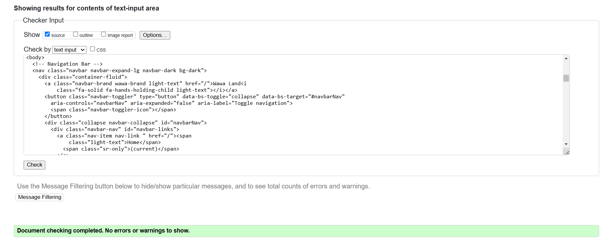

# Testing

## Validator Testing

Wawa Land has be thoroughly tested. All the code has been run through the [W3C html Validator](https://validator.w3.org/), the [W3C CSS Validator](https://jigsaw.w3.org/css-validator/) and the [JSHint JavaScript Validator](https://jshint.com/). 

HTML

| Page                    | Screenshot                                                                             | Notes    |
|-------------------------|----------------------------------------------------------------------------------------|----------|
| Home                    |                                  | PASS     |
| Blog - logged out       |                 | PASS     |
| Blog - logged in        |                 | PASS     |
| Blog Post - logged out  |                 | PASS     |
| Blog Post - logged in   |                 | PASS     |
| Event List              |                 | PASS     |
| Event Listing           |                 | The code the validator is referring to is code which has been integrated by Django for the review functionality and not written by me. The id is specific to each review and the '
' tag cannot be deleted by me.   |
| Blog - logged out       |                 | PASS     |

The HTML W3C Validator Results:

The CSS Validator Results:

The JSHINT Validator Results for Both Pages:
- script.js:

- quiz.js:

## Manual Testing
- Manual testing was carried out on local and deployed sites.

| Location     | Feature         | Expected Outcome                               | Pass/Fail| Notes                   |
|--------------|--------------   |------------------------------------------------|----------|-------------------------|
| Header       | Home button     | Takes user to home                             |  PASS    |
| Header       | Log-in button   | Takes user to log-in page on click             |  PASS    | If user is not logged in, the register and log-in buttons will be displayed, but if they are logged in, only the log-out button will appear |
| Header       | Register button  | Takes user to registration page on click                                       | PASS      |                                                                                                           |
| Header       | Logout button    | Takes user to log-out page on click                                            | PASS      |                                                                                                           |
| Log-in page  | Log-in function  | When user enters an unknown username, the user will not be logged in           | PASS      |                                                                                                           |
| Log-in page  | Log-in function  | When user enters an unknown password, the user will not be logged in           | PASS      |                                                                                                           |
| Log-in page  | Log-in function  | When user enters a known username AND password, the user will be logged in     | PASS      |                                                                                                           |

